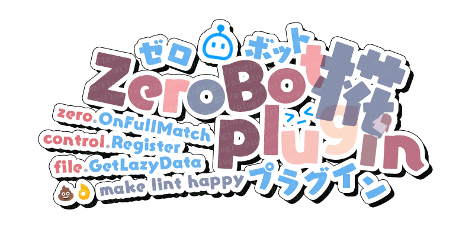

  
  <h1>ZeroBot-Plugin UwU</h1>
  
ZeroBot-Plugin VTuberized Logo.

> [!Important]
> In no circumstances do I allow the use of a logo I created for AI learning.

## Tools used for designing

- Adobe Photoshop
- Font: FOT - ユールカ (FOT - Eureka)

## Designers

- [Jiang-Red](https://github.com/Jiang-Red)
- [fumiama](https://github.com/fumiama)

## License

This work is licensed under the Creative Commons Attribution-NonCommercial-ShareAlike 4.0 International License. To view a copy of this license, visit [CC BY-NC-SA 4.0](https://creativecommons.org/licenses/by-nc-sa/4.0/).

> [!NOTE]
> - **The font required additional licensing. Please go to the [LETS Website](https://lets.fontworks.co.jp/) for more information.**
> - The creator of these logos is Lipraty. Copyright is not fully relinquished.
> - You CAN'T use this logo for commercial purposes.
> - The FloatTech organization and its members have the right to use this logo for any purpose.(Except for the font.)

Copyright © 2024 [@Jiang-Red](https://github.com/Jiang-Red) [@fumiama](https://github.com/fumiama) All Rights Reserved.
